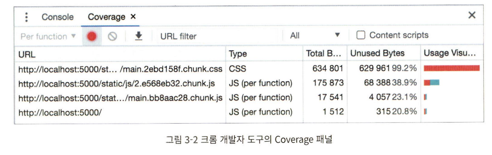
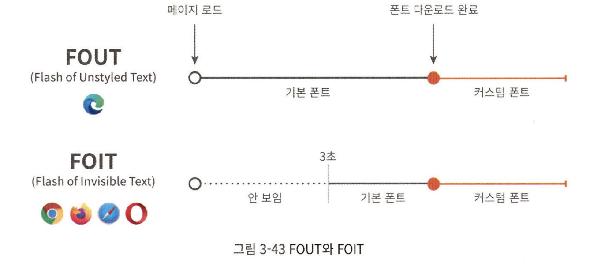

## Lecture-3 : 홈페이지 최적화


프론트엔드 성능 최적화 가이드 책의 part 3 실습 내용입니다.
자세한 스텝은 `커밋 내역`을 참고 바랍니다.

### 실행

1. download sources

```
$ git clone https://github.com/performance-lecture/lecture-1.git
```

2. install dependencies

```
$ npm install
or
$ yarn
```

3. start development server

```
$ npm run start
or
$ yarn start
```

4. start json-server

```
$ npm run server
or
$ yarn server
```

\*3번의 dev server 와 다른 콘솔에서 띄워줍니다.

5. build + serve

```
$ npm run serve
or
$ yarn serve
```

### 실습 내용

- 이미지 지연 로딩
- 이미지 사이즈 최적화
  - CDN에 있는 이미지가 아닌 서버에 저장되어 있는 정적 이미지 최적화
- 폰트 최적화
  - 커스텀 폰트는 성능 문제 야기 가능
- 캐시 최적화
  - 자주 사용하는 리소스를 브라우저에 저장하고 다음번에 재사용
- 불필요한 CSS 제거

### 분석 툴

#### 크롬 개발자 도구의 Coverage 패널

- 웹 페이지를 렌더링하는 과정에서 어떤 코드가 실행되었는지 보여줌
- 각 파일의 코드가 얼마나 실행되었는지 비율로 나타냄
- 특정 파일에서 극히 일부의 코드만 실행되었다면(퍼센테이지가 낮다면) 해당 파일에 불필요한 코드가 많이 포함되어 있다고 볼 수 있음

  

#### Squoosh

이미지 압축 웹서비스
웹에서 간편하게 이미지 포맷 / 사이즈 변경 가능

#### PurgeCSS

사용하지 않는 CSS를 제거해주는 도구

- npm에 등록되어 있음
  - cli로 사용 가능
  - webpack같은 번들러 플러그인으로 추가 사용 가능

### 프로젝트 구조

- 메인 페이지에 비디오가 있음
  - 동영상이 제일 중요함 (우선순위 높음)
- 메인 페이지에 꽤 많은 이미지가 렌더링되고 있음
  - 이미지에 지연 로드 적용
  - intersection observer
- 서버의 Cache Control
- 이미지 파일이 너무 큼
  - 가로 세로 사이즈를 줄여 이미지 용량을 줄이고 그만큼 더 빠르게 다운로드
    - 가장클 때 기준으로 가로 세로 2배 정도
    - 압축률은 70~80정도
    - Effort는 기본값
  - 이미지 포맷을 적절하게 선택

[sqoosh](https://squoosh.app/editor)

#### 동영상 최적화

- 동영상은 이미지처럼 하나의 요청으로 모든 영상을 다운로드하지 않음
- 당장 재생이 필요한 앞부분을 먼저 다운로드한 뒤 순차적으로 나머지 내용 다운로드
- 가로, 세로사이즈, 압축방식, 프레임 레이트
- 동영상 압축은 화질을 낮춤. 메인 컨텐츠라면 비추천
- 동영상이 메인 서비스가 아닌 경우 최적화

[media.io](https://www.media.io/app)

#### 폰트 최적화

- 네트워크 Fast 3G로 쓰로틀 하고 새로고침하면 배너 텍스트가 변함
- 폰트 다운로드가 왼료되지 않아서 생기는 현상
- 폰트 깜빡임은 사용성에 영향을 줌
- FOUT(Flash of Unstyled Text)
  - 엣지에서 폰트를 로드하는 방식
  - 폰트 다운로드 여부와 상관없이 먼저 텍스트를 보여준 후, 폰트가 다운되면 그때 폰트를 적용함
- FOIT(Flash of Invisivble Text)
  - 크롬, 사파리 파이어폭스에서 폰트를 로드하는 방식
  - 폰트 다운로드 전까지 텍스트 자체를 안보여줌
  - 3초 이후에 다운 안되면 기본 폰트 보여줌
  - 3초 이후에 커스텀 폰트 다운되면 그걸로 바꿔보여줌
    

##### 폰트 최적화 방법

- 폰트 적용 시점 제어
- 폰트 사이즈 줄이기

###### 폰트 적용 시점 제어

CSS의 font-display 속성

- auto : 브라우저 기본 동작(기본값)
- block : FOIT (timeout : 3s)
- swap : FOUT
- fallback : FOIT(timeout : 0.1) / 3초 이후에도 못불러오면 기본 폰트로 유지, 이후 캐시
- swap : fallback이랑 비슷하지만 네트워크 상태에 따라 3초 이후에도 변경할 수 있음, 이후 캐시

컨텐츠 특성에 맞게 적절한 값 선택 중요
해당 실습에서는 block 사용.
빠르게 보여줘야 하거나 중요한 내용이 아니기 때문에
폰트가 적용된 상태로 보이는 것이 좀 더 자연스러움

- 안보이던 폰트가 갑자기 나타나는 현상은 fade-in 애니메이션으로 보강
  - 이와 같이 사용자에게 보기 편하게 서비스하는 것도 체감 성능을 높이는 데 중요함

###### 폰트 파일 크기 줄이기

폰트 파일 크기를 줄여 폰트가 다운로드되는 시간을 단축하는 방법

- 압축률이 좋은 폰트 포맷 사용하기
- 필요한 문자의 폰트만 로딩하기

운영체제 폰트 포맷 TTF, OTF는 매번 리소스를 다운로드해야 하는 웹 환경에서는 적절하지 않음
웹을 위한 폰트 WOFF(web open font format)/ WOFF2
[Transfonter](https://transfonter.org)
